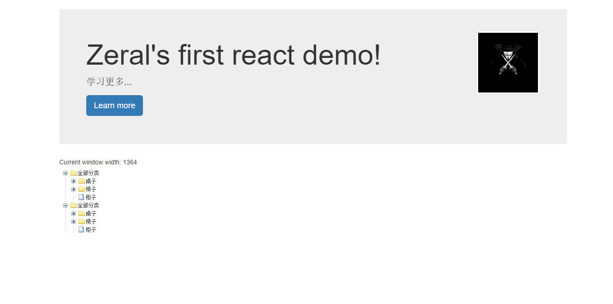

该项目包含了个人学习过程中 Demo，从简单到复杂，一步步踏入前端的坑。

部分项目使用 [Create React App](https://github.com/facebookincubator/create-react-app) 构建，用于快速搭建环境

---

## 开始学习

所有项目使用 `yarn` 作为依赖管理工具。

* 构建 `yarn`
* 运行 `yarn start`

### 项目概览

* [simple-demo](./simple-demo/README.md) 实现简单的 ZTree 风格的树和异步请求
  
* [redux-demo](./redux-demo/README.md) 实现基于 Redux 状态管理的

## 树组件组成

- `TreeComponent` 负责渲染整个树
  - 传参：
    - `TreeId` tree 标识
    - `NodeList` tree 所有数据
   - 方法：
    - `onClickFunc` 节点点击事件
- `NodeComponent` 负责渲染树的一个节点
- `SubTreeComponent` 负责渲染子树的，大致和 Tree 组件相同，重写是为了和 Tree 组件有不同的功能和样式

为每个组件添加 `key` 或 `id` 的目的是为了在重新渲染时加快 react diff 算法速度，即比较虚拟 Dom 和真实 Dom，具体查看
[keys](https://doc.react-china.org/docs/lists-and-keys.html#keys)

## 作者

* **Zeral** - [个人主页 https://zeral-zhang.github.io](https://zeral-zhang.github.io)